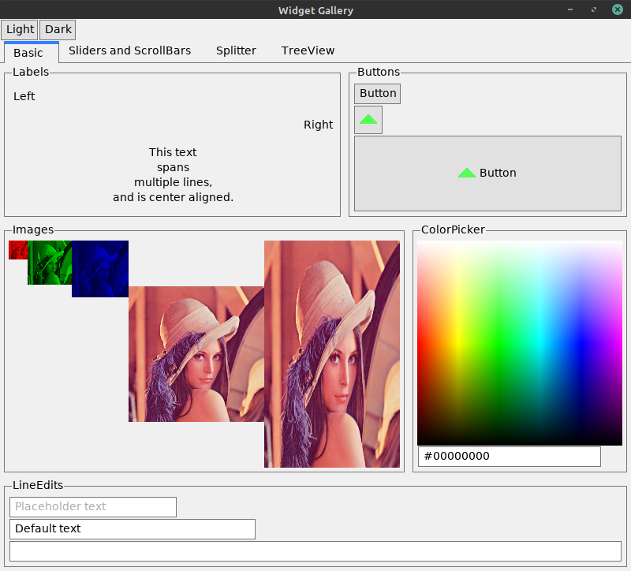
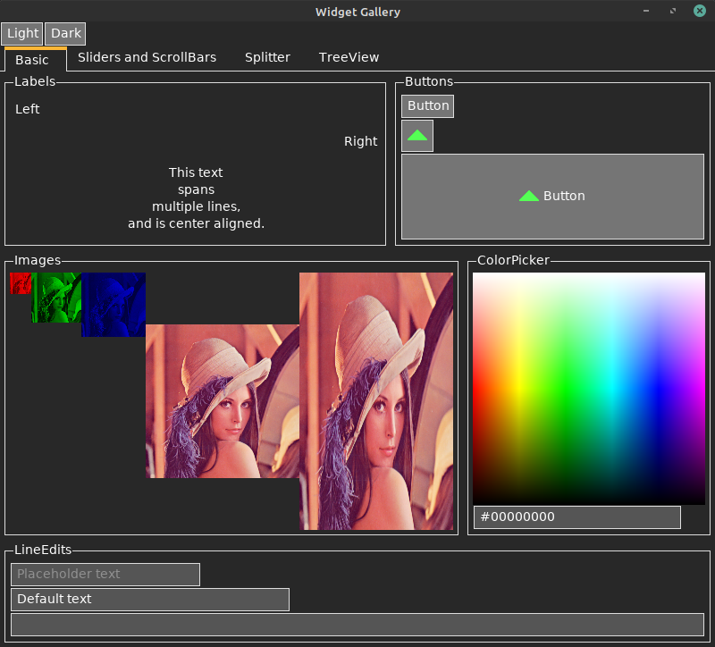
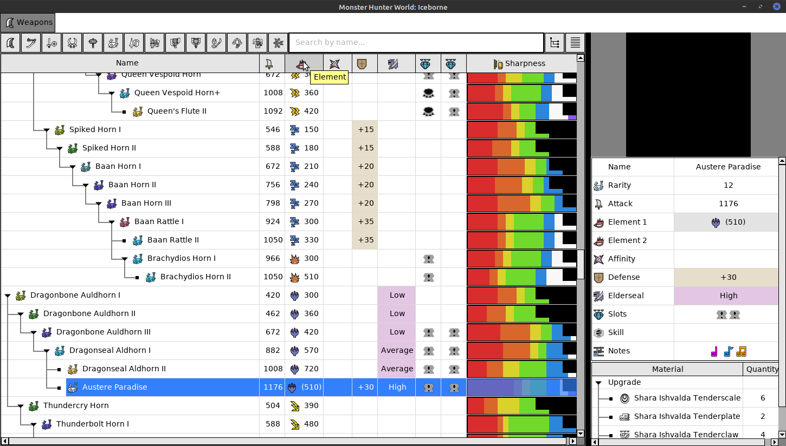

# Agro
This is an object-oriented GUI library that I'm currently working on.
The drawing backend uses an OpenGL batch renderer.
Cross-platform system events and windowing is done using SDL2.
FreeType2 is used for making bitmaps for drawing text.

**Note that the library is very work in progress!**







## Build
The library is tested and working on Windows 10 and Linux (Mint 20.1).
You will need:
* C++14 compatible compiler
* CMake at least `3.16.3`
* SDL2
* FreeType2
* Graphics card that supports OpenGL Core 3.3 at least (Tested on RX 5700XT and Intel HD 4000)

On debian based system you should be able to install the dependencies like so:
```
sudo apt install g++
sudo apt install cmake
sudo apt install libfreetype6-dev
sudo apt install libsdl2-dev
```

### Instructions
**Note that the project builds in release mode and as a static lib by default!**
1. First make sure you are in the root directory of the project.
2. Run `cmake -S . -B build  -DCMAKE_BUILD_TYPE=RELEASE` in the terminal to build the required CMake files.
3. Building is slightly different using MSVC vs GCC
    * When using GCC use `cmake --build build` in the terminal to build the actual project.
    * When using MSVC use `cmake --build build --config Release` in the terminal to build the actual project.

You can verify that the library has built correctly by running one of the example files in the `Agro/bin` folder.

### Installing
On Unix platforms you can run `cmake --install build` to install the library.
From then on you can link against the library by specifying its name `Agro` and including it like so `#include <Agro/application.hpp>`

**The instructions for Windows are incomplete for the moment!**
