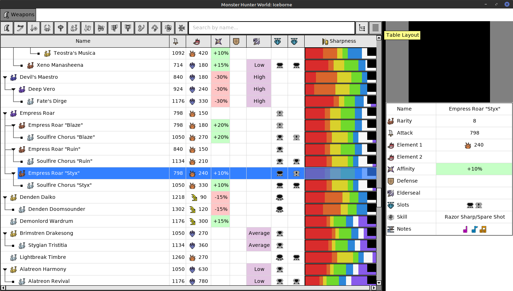

# OpenGLGUI
This is an object-oriented GUI library that I'm currently working on.
The drawing backend uses an OpenGL batch renderer.
Cross-platform system events and windowing is done using SDL2.
FreeType2 is used for making bitmaps for drawing text.

**Note that the library is very work in progress!**

## Build
The library is tested and working on Windows 10 and Linux (Mint 20.1 and Kubuntu 20.04) but
I'm only providing build instructions for Linux at the moment.

You will need:
* C++11 compatible version of g++
* SDL2
* FreeType2
* Graphics card that supports OpenGL Core 3.3 at least (Tested on RX 5700XT and Intel HD 4000)

After that you should be able to just run `make` in the root directory.
This will run whatever test program happens to be in `main.cpp`.